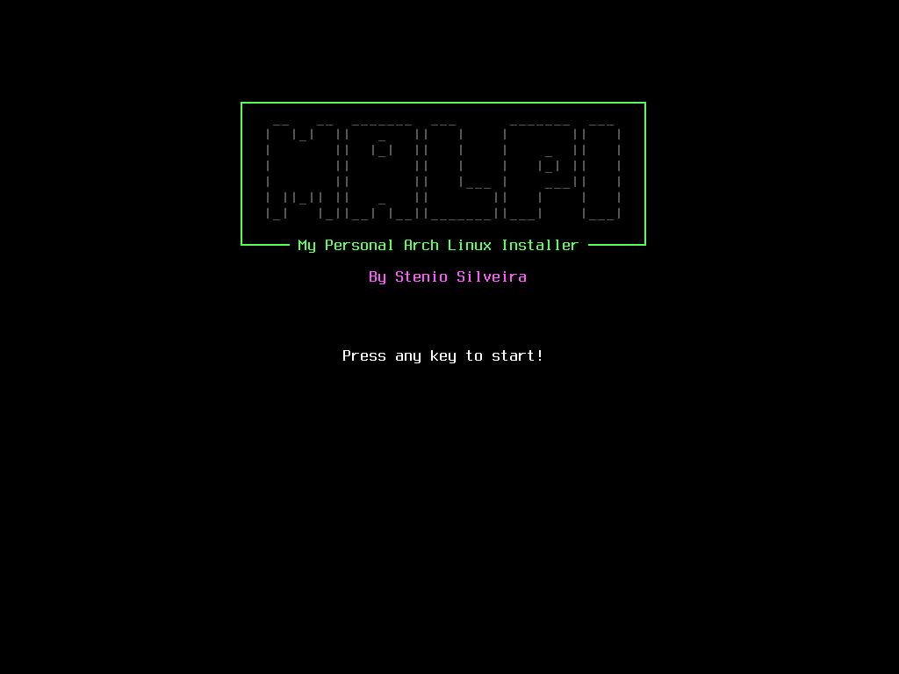

<h1 align="center">
  malpi
</h1>

<h3 align="center">
  <a href="https://www.archlinux.org">Arch Linux</a> + Btrfs + Luks
</h3>

Um script shell, simples e amador, para instalar o Arch Linux nos meus computadores pessoais. Você pode usá-lo e modificá-lo como quiser.

 

  
  
  
  

 

## Notas
* É aconselhável que você já saiba como instalar o Arch da forma tradicional, seguindo o [**guia de instalação**](https://wiki.archlinux.org/index.php/Installation_guide_(Português)) disponível na ArchWiki, o objetivo deste script é acelerar as minhas instalações e não pular etapas no aprendizado.
* Se preferir você pode particionar seu disco antes de executar o script.
* Você pode testar em uma **Máquina Virtual** primeiro se preferir.
* A fonte do console será alterada durante a execução do script.
* Tenho intensões de migrar o script para a ferramenta [**whiptail**](https://linux.die.net/man/1/whiptail).
* A ideia de criar este script surgiu pela vontade de praticar a linguagem shell, nada mais.

## Pré-requisitos

- Uma conexão de internet funcionando.
- Estar logado como usuário 'root'.

## Obtendo o script

### curl
	curl -L stenioas.github.io/malpi/malpi > malpi

### wget
	wget stenioas.github.io/malpi/malpi

### git
	git clone https://github.com/stenioas/malpi

## Como usar

### Informações importantes:

1. Este script presume que você sabe o seu mapa de teclado e ele já estará carregado.
2. Somente o modo [**UEFI**](https://wiki.archlinux.org/index.php/Unified_Extensible_Firmware_Interface) é suportado.
3. Este script utiliza apenas duas partições, [**ESP**](https://wiki.archlinux.org/index.php/EFI_system_partition_(Português)) e **ROOT**.
4. A partição raiz será formatada com o sistema de arquivos [**BTRFS**](https://wiki.archlinux.org/index.php/Btrfs_(Português)).
5. Este script irá criar 4 [**subvolumes**](https://wiki.archlinux.org/index.php/Btrfs_(Português)#Subvolumes):
	- **@** para /
	- **@home** para /home
	- **@pkgs** para /var/cache/pacman/pkgs
	- **@snapshots** para /.snapshots
6. A partição EFI pode ser formatada em FAT32 se o usuário quiser.
7. [**SWAP**](https://wiki.archlinux.org/index.php/Swap_(Português)) não é suportada.
8. [**NetworkManager**](https://wiki.archlinux.org/index.php/NetworkManager_(Português)) é instalado por padrão.
9. Apenas [**Grub**](https://wiki.archlinux.org/index.php/GRUB_(Português)) e [**Systemd-boot**](https://wiki.archlinux.org/index.php/Systemd-boot) estão disponíveis.
10. O script pode ser cancelado a qualquer momento com **CTRL+C**.
11. **ESTE SCRIPT AINDA NÃO ESTÁ COMPLETO!**

##### Dicas:
  - Uma partição ou arquivo SWAP pode ser criado após a instalação do sistema.
  - A partição home pode ser migrada para outro disco ou partição após a instalação do sistema.

### Primeira etapa (*Instalação da base*)

Inicialize com a última [imagem do Arch Linux](https://www.archlinux.org/download/) em um [dispositivo bootável](https://wiki.archlinux.org/index.php/USB_flash_installation_media_(Português)).

Em seguida, certifique-se de ter uma conexão com a Internet na iso live do Arch. Se você tiver uma conexão sem fio, o comando [`iwctl`](https://wiki.archlinux.org/index.php/Iwd_(Português)#iwctl) pode ser útil para você. Você também pode ler a  [Configuração de rede](https://wiki.archlinux.org/index.php/USB_flash_installation_medium_(Português)) do guia do Arch Linux para obter instruções mais detalhadas.

Finalmente, inicie a primeira etapa do script com o comando abaixo:

    sh malpi -i

ou

	sh malpi --install

Em seguida, siga as instruções na tela para concluir.

##### Funcionalidades
- Configura a fonte do console
- Configura o ntp como true `timedatectl set-ntp true`
- Classifica os espelhos (*por país*)
- Seleciona e particiona o disco
- Formata e monta as partições **EFI** e **ROOT**
- Seleciona a versão do kernel
- Seleciona a versão do microcode
- Instala a base
- Configura o fstab
- Configura o fuso horário
- Configura a localidade
- Configura a rede(arquivos ***hostname** e **hosts***)
- Configura o initramfs
- Configura a senha de root
- Instala o bootloader

### Segunda etapa (*Pós-Instalação*) ###

> A segunda etapa oferece a pós-instalação.

Inicie a segunda etapa do script, após obter sucesso na primeira etapa, com o comando abaixo:

	sh malpi -p

ou

	sh malpi --post

##### Funcionalidades
- Cria e configura um novo usuário
- Habilita o repositório Multilib
- Instala o Xorg
- Instala um driver de vídeo (*Atualmente apenas intel e virtualbox disponíveis*)
- Instala um Desktop Environment ou Window Manager ***(Opcional)***
- Instala um Display Manager ou Xinit ***(Opcional)***
- Instala pacotes extras ***(Opcional)***
- Instala pacotes para laptops ***(Opcional)***
- Instala o YAY ***(Opcional)***
- Remove pacotes órfãos

---

## Referências

- [**ArchWiki**](https://wiki.archlinux.org/index.php/Main_page_(Português))
- Script [**archfi**](https://github.com/MatMoul/archfi) (por [***MatMoul***](https://github.com/MatMoul))
- Script [**aui**](https://github.com/helmuthdu/aui) (por [***Helmuthdu***](https://github.com/helmuthdu))
- Script [**pos-alpine**](https://terminalroot.com.br/2019/12/alpine-linux-com-awesomewm-nao-recomendado-para-usuarios-nutella.html) (por [***Terminal Root***](https://terminalroot.com.br/))

---
<h2 align="center">Btw, obrigado por dedicar seu tempo a conhecer o meu projeto!</h2>
